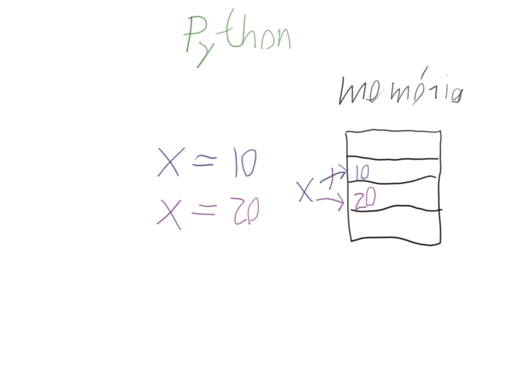

# Adattípusok

(2019. 10. 14. - 4. óra)

Mittelholcz Iván

---

## 1. Interaktív Python

```sh
python
```

- nem kell fájlt megadni
- gyorsan ki lehet próbálni egy ötletet
- az iypthon jobb (szintaxis, kiegészítés TAB-bal, indentálás)
  - telepítés:  `sudo pip install jupyter`
  - indítás: `ipython`
- előzmények: felfele/lefele nyíl
- kilépés: Ctrl+D

## 2. Adat és utasítás

```python
len('alma')
```

Dokumentáció:

- típusok: <https://docs.python.org/3/library/stdtypes.html>
- függvények: <https://docs.python.org/3/library/functions.html>

## 3. Változók és értékadás

Változó: címke egy memóriaterületen (pl. C/C++)


Változó: címke egy memóriában lévő objektumon (Python)



### Trükkös értékadások

```python
x = 10
x = y = 10
x, y = 10, 20
```

## 4. Miért van az adatoknak típusa?

```python
type(adat)
```

- memóriaigény
- műveletek

### Függvények

```py
x = 10
s = 'alma'

print(x)
print(s)

len(x)
len(s)
```

### Metódusok és műveletek

```py
x + 20
x + 'alma'

s.upper()
x.upper()

x.__add__(20)
```

## 5. Egyszerű adattípusok

### Igazságérték (*boolean*)

- lehetséges értékek: `True` vagy`False`
- műveletek: `and`, `or`, `not`
- kapcsolódó függvények: `bool()`

### Egész számok (*integer*)

- lehetséges értékek: ~
- műveletek: `+`, `-`, `*`, `/`, `//`, `%`, `**`, `<`, `<=` `>`, `>=`, `==`, `!=`
- kapcsolódó függvények: `int()`, `bin()`, `oct()`, `hex()`

### Lebegőpontos számok (*float*)

- lehetséges értékek: tizedestörtek
- műveletek: `+`, `-`, `*`, `/`, `//`, `%`, `**`, `<`, `<=` `>`, `>=`, `==`, `!=`
- kapcsolódó függvények: `float()`, `round()`

### Karakterláncok (*string*)

- lehetséges értékek: ~
- jelölés: `'valami'` vagy `"valami"`
- műveletek: `+ <string>`, `* <int>`, `<`, `<=` `>`, `>=`

#### Karakterláncok indexelése, szeletelése

- `s[i]`: `s` karakterlánc `i`-edik karaktere
- `s[:i]`: `i`-edik karakterig az összes, `i` már nem
- `s[i:]`: `i`-edik karaktertől az összes, `i` is
- `s[i:j]`: `i`-edik karaktertől a `j`-edikig, `i`-edik benne van `j`-edik már nincs

#### Karakterláncok metódusai

- `s.upper()`: nagybetűsít
- `s.lower()`: kisbetűsít
- `s.endswith(suffix)`: igaz, suffixszel végződik a string
- `s.startswith(prefix)`: igaz, prefixszel kezdődik a string
- `s.isdigit()`: igaz, ha `s` csak számjegyeket tartalmaz
- `s.isalpha()`: igaz, ha `s` csak betűket tartalmaz
- `s.isspace()`: igaz, ha `s` csak szóközjellegű karaktereket tartalmaz
- `s.strip()`: levágja a string elején és végén lévő szóközjellegű karaktereket
  - a `s.strip(karakterek)` levágja szóközök helyett a felsorolt karaktereket vágja le
  - az `lstrip()`, és az `rstrip()` csak a bal- ill. jobboldaliakat vágja le
- `s.split(delimiter)`: felszeleteli a stringet delimiterek mentén, a szeletek listáját adja vissza
  - a `s.split()` a szóközjellegű karaktereket mentén darabol
- `s.replace(mit, mire)`: lecseréli a stringben az elsőként megadott paraméter előfordulásait a második paraméterre

Továbbiak: <https://docs.python.org/3/library/stdtypes.html#string-methods>
